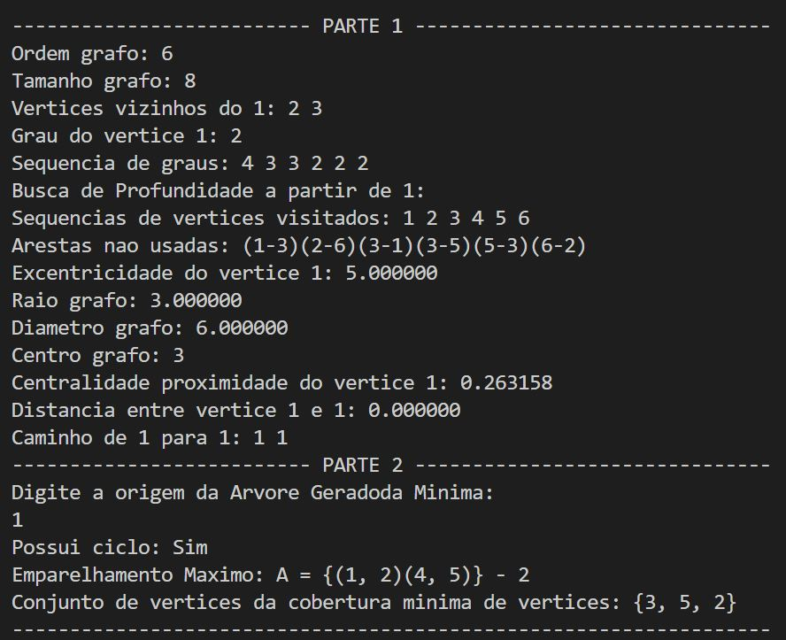

# grafos-tp01

## Descrição
Trabalho feito com o objetivo de trazer diversos algoritmos direcionados a grafos e suas aplicações

Link do Video que explica a primeira parte: https://www.youtube.com/watch?v=Y4_ZapfNgcE&ab_channel=%C3%82ngeloCupertino

Link do Video que explica a segunda parte: https://www.youtube.com/watch?v=JDJILTIkGMM&ab_channel=%C3%82ngeloCupertino
- - - -

 * [x] Retornar a ordem do grafo
 * [x] Retornar o tamanho do grafo
 * [x] Retornar os vizinhos de um vértice fornecido
 * [x] Determinar o grau de um vértice fornecido
 * [x] Retornar a sequência de graus do grafo
 * [x] Determinar a excentricidade de um vértice
 * [x] Determinar o raio do grafo
 * [x] Determinar o diâmetro do grafo
 * [x] Determinar o centro do grafo
 * [x] Determinar a sequência de vértices visitados na busca em profundidade e
informar a(s) aresta(s) que não faz(em) parte da árvore de busca em profundidade.
 * [x] Determinar distância e caminho mínimo
 * [x] Determinar a centralidade de proximidade C de um vértice x, dada por1
 * [x] Verificar se um grafo possui ciclo.
 * [x] Determinar a árvore geradora mínima de um grafo.
 * [x] A árvore geradora mínima deve ser escrita em um arquivo (no mesmo formato
de entrada do grafo), assim como seu peso total.
 * [x] Determinar uma cobertura mínima de vértices de um grafo por meio de uma
heurística.
 * [x] Determinar o emparelhamento máximo em um grafo

- - - -
## Como executar

```
make compile
```

```
make run
```

- - - -
## Resultado Terminal


- - - -
    
## Contribuidores


- [Angelo Machado](https://github.com/acmachado14)
- [Arthur Bastos](https://github.com/ArthurFBastos)
- [Guilherme Augusto](https://github.com/Guilherme-Schwann)
- [Iury Martins](https://github.com/iurymartins46)

