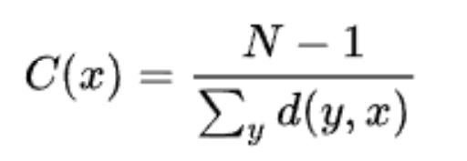

# grafos-tp01

 * [ ] Retornar a ordem do grafo
 * [ ] Retornar o tamanho do grafo
 * [ ] Retornar os vizinhos de um vértice fornecido
 * [ ] Determinar o grau de um vértice fornecido
 * [ ] Retornar a sequência de graus do grafo
 * [ ] Determinar a excentricidade de um vértice
 * [ ] Determinar o raio do grafo
 * [ ] Determinar o diâmetro do grafo
 * [ ] Determinar o centro do grafo
 * [ ] Determinar a sequência de vértices visitados na busca em profundidade e
informar a(s) aresta(s) que não faz(em) parte da árvore de busca em profundidade.
 * [ ] Determinar distância e caminho mínimo
 * [ ] Determinar a centralidade de proximidade C de um vértice x, dada por1

- - - -
<h2 id="contribuidores">
    Contribuidores
</h2>

- [Angelo Machado](https://github.com/acmachado14)
- [Arthur Bastos](https://github.com/ArthurFBastos)
- [Guilherme Augusto](https://github.com/Guilherme-Schwann)
- [Iury Martins](https://github.com/iurymartins46)
